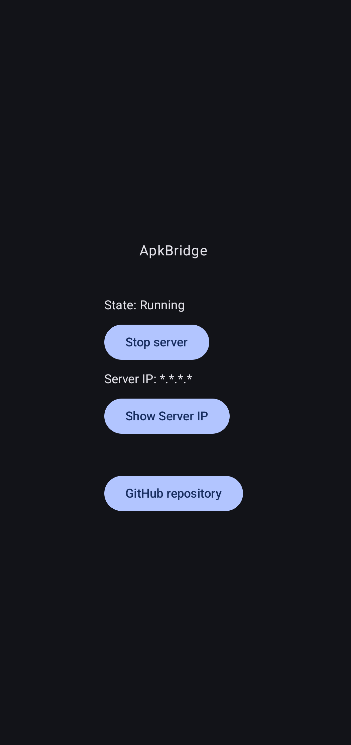

<p align="center">
 
</p>

<h1 align="center"> ApkBridge </h1>

<div align="center">

[](https://github.com/kodjodevf/mangayomi/releases)

[](https://discord.com/invite/EjfBuYahsP)


An Android Proxy Server for invoking APK stub functions.
</div>

## Installing

Download [ApkBridge.apk](https://github.com/Schnitzel5/ApkBridge/releases/latest) and press on "Start server" after the installation.



## Build from souce

```
git pull https://github.com/Schnitzel5/ApkBridge.git
cd ApkBridge
chmod +x ./gradlew
./gradlew build
./gradlew assembleRelease
```

Make sure to provide the signing keys in a new file "local.properties":

```
storePassword=<password>
keyPassword=<password>
keyAlias=<key alias>
storeFile=<path to the keystore file>
```

## License

```
Copyright 2025 Schnitzel5

Licensed under the Apache License, Version 2.0 (the "License");
you may not use this file except in compliance with the License.
You may obtain a copy of the License at

http://www.apache.org/licenses/LICENSE-2.0

Unless required by applicable law or agreed to in writing, software
distributed under the License is distributed on an "AS IS" BASIS,
WITHOUT WARRANTIES OR CONDITIONS OF ANY KIND, either express or implied.
See the License for the specific language governing permissions and
limitations under the License.
```

## Disclaimer

The developer(s) of this application does not have any affiliation with the content providers that are freely available in the internet.
